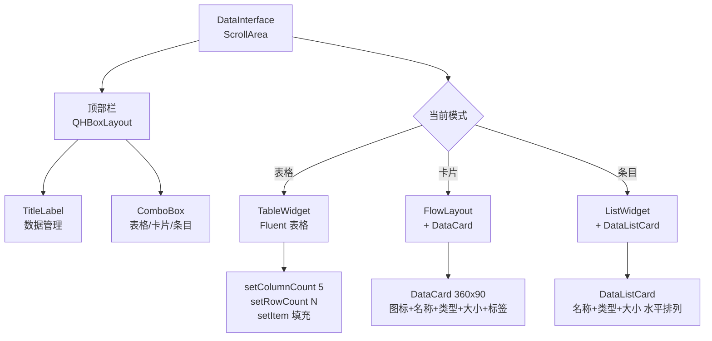
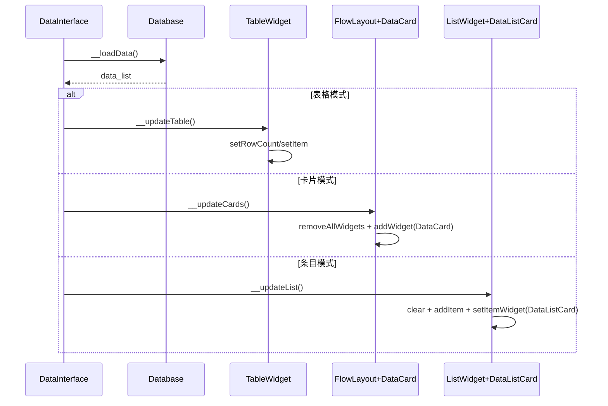

# 修复 data_interface.py 展示模式计划

## 概要

将 `data_interface.py` 的三种展示模式（表格/卡片/条目）从原生 Qt 组件迁移到 PyQt-Fluent-Widgets 组件，并将模式切换从 `SegmentedWidget` 改为右上角 `ComboBox` 下拉框。

## 当前状态分析

### 现有问题
1. **表格模式**：使用 `QTableView + QAbstractTableModel`，缺少 Fluent Design 风格（无圆角边框、无行悬停高亮、无选中指示条）
2. **卡片模式**：`DataCard` 定义在 `data_interface.py` 内部，不符合组件分离惯例；卡片信息展示简陋
3. **条目模式**：使用 `QListWidget`，缺少 Fluent 风格；列表项只是纯文本，没有卡片化展示
4. **模式切换**：使用 `SegmentedWidget` 占据整行，不够紧凑

### 参考模式
- **表格**：gallery 的 `TableFrame` → 使用 `TableWidget`（自带交替行色、行悬停、选中指示条、圆角边框）
- **卡片**：`SampleCard` → 使用 `CardWidget` + `IconWidget` + `BodyLabel/CaptionLabel`
- **列表**：gallery 的 `ListFrame` → 使用 `ListWidget`
- **下拉框**：`ComboBox` from qfluentwidgets

## 修改方案

### 1. 表格模式：QTableView → TableWidget

**文件**: `src/app/view/data_interface.py`

- 移除 `DataTableModel(QAbstractTableModel)` 类
- 将 `self.tableView = QTableView` 替换为 `self.tableView = TableWidget`
- 参考 gallery `TableFrame` 的用法：
  - `self.tableView.verticalHeader().hide()`
  - `self.tableView.setBorderRadius(8)`
  - `self.tableView.setBorderVisible(True)`
  - 使用 `setColumnCount()`, `setRowCount()`, `setHorizontalHeaderLabels()`, `setItem()` 填充数据
- `__updateTable()` 方法改为直接操作 `TableWidget.setItem()`

### 2. 卡片模式：创建 DataCard 组件

**新文件**: `src/app/components/data_card.py`

参考 `SampleCard` 的设计，创建 `DataCard(CardWidget)`：
- 左侧：类型图标（根据 `DataType` 枚举选择 `FluentIcon`）
- 右侧：名称(BodyLabel) + 类型/大小/标签(CaptionLabel)
- 固定尺寸：360x90（与 SampleCard 一致）
- 点击信号：可后续扩展

**修改文件**: `src/app/components/__init__.py`
- 添加 `from .data_card import DataCard`

**修改文件**: `src/app/view/data_interface.py`
- 移除内部 `DataCard` 类
- 从 `..components` 导入 `DataCard`
- `__updateCards()` 使用新的 `DataCard`

### 3. 条目模式：QListWidget → ListWidget + DataListCard

**新文件**: `src/app/components/data_card.py`（与 DataCard 同文件）

创建 `DataListCard(CardWidget)`：
- 水平布局：左侧名称(BodyLabel) + 右侧类型/大小信息(CaptionLabel)
- 高度固定 48px，宽度自适应
- 点击信号：可后续扩展

**修改文件**: `src/app/view/data_interface.py`
- 将 `self.listView = QListWidget` 替换为 `self.listView = ListWidget`
- `__updateList()` 改为创建 `DataListCard` 作为列表项的自定义 widget

### 4. 模式切换：SegmentedWidget → ComboBox

**文件**: `src/app/view/data_interface.py`

- 移除 `SegmentedWidget` 的导入和使用
- 添加 `ComboBox` 导入
- 在界面顶部标题行右侧添加 `ComboBox`：
  - 标题标签(TitleLabel) "数据管理" 在左侧
  - ComboBox 在右侧
  - 使用 QHBoxLayout 作为顶部栏
- ComboBox 选项：`["表格", "卡片", "条目"]`
- 连接 `currentIndexChanged` 信号到 `__switchMode`

### 5. 样式更新

**文件**: `src/app/resource/qss/dark/data_interface.qss` 和 `light/data_interface.qss`

- 移除 `QTableView` 样式（TableWidget 自带 Fluent 样式）
- 移除 `QListWidget` 样式（ListWidget 自带 Fluent 样式）
- 保留 `DataInterface/#view` 透明背景
- 添加 `DataCard` 和 `DataListCard` 的样式（如果需要覆盖 CardWidget 默认样式）

## 具体文件变更

| 文件 | 操作 | 说明 |
|------|------|------|
| `src/app/components/data_card.py` | 新建 | DataCard + DataListCard 组件 |
| `src/app/components/__init__.py` | 修改 | 导出 DataCard, DataListCard |
| `src/app/view/data_interface.py` | 重写 | 使用 Fluent 组件重构三种模式 |
| `src/app/resource/qss/dark/data_interface.qss` | 修改 | 更新样式选择器 |
| `src/app/resource/qss/light/data_interface.qss` | 修改 | 更新样式选择器 |

## 架构图

## 数据流

## 验证步骤

1. 启动应用，进入"数据管理"页面
2. 默认显示表格模式，验证 TableWidget 有 Fluent 风格（交替行色、悬停高亮、圆角边框）
3. 切换到卡片模式，验证 DataCard 正确显示（图标、名称、类型、大小、标签）
4. 切换到条目模式，验证 ListWidget + DataListCard 正确显示
5. 右上角 ComboBox 切换三种模式，验证切换流畅
6. 验证暗色/亮色主题切换后样式正确
7. 调用 `refresh_data()` 验证数据刷新后三种模式都能正确更新

## 假设与决策

1. **DataCard 尺寸**：采用与 SampleCard 相同的 360x90，保证视觉一致性
2. **DataListCard**：使用 CardWidget 而非纯文本，提供更好的交互体验
3. **TableWidget 数据填充**：直接使用 `setItem(QTableWidgetItem)` 方式，与 gallery 示例一致，不再使用 QAbstractTableModel
4. **ComboBox 位置**：放在顶部标题行右侧，与标题同一行，节省垂直空间
5. **DataType 图标映射**：为每种数据类型分配一个 FluentIcon（如 IMAGE→PHOTO, VIDEO→VIDEO, AUDIO→MUSIC, DOC/DOCX→DOCUMENT, EXCEL→DOCUMENT, PPT→VIDEO, TEXT→EDIT, UNKNOWN→HELP）
