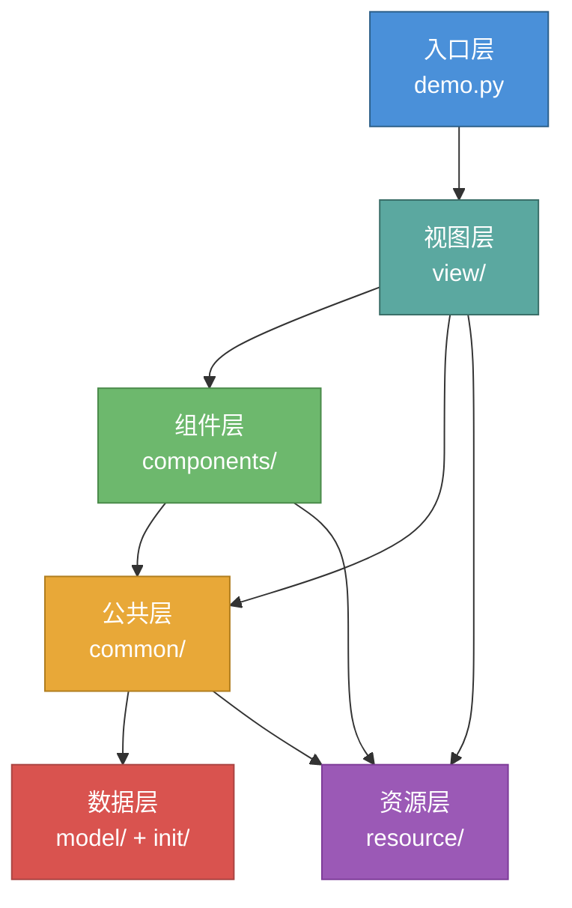
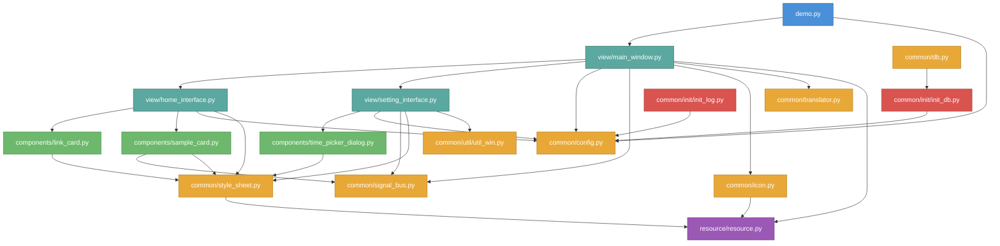
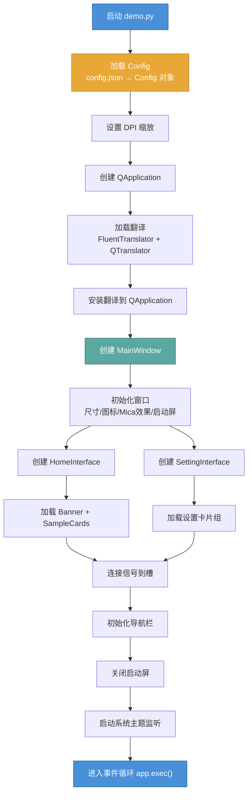
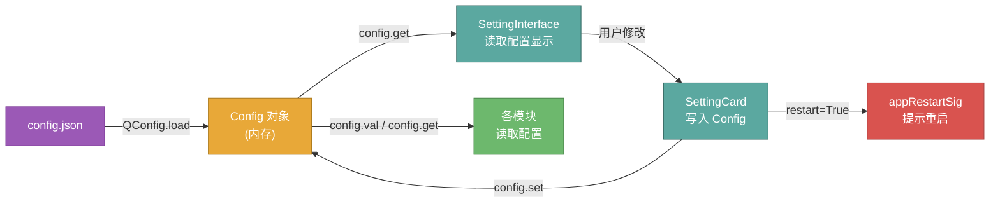
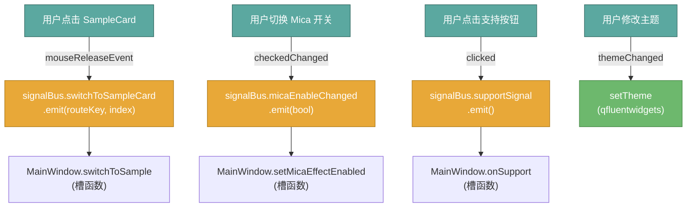
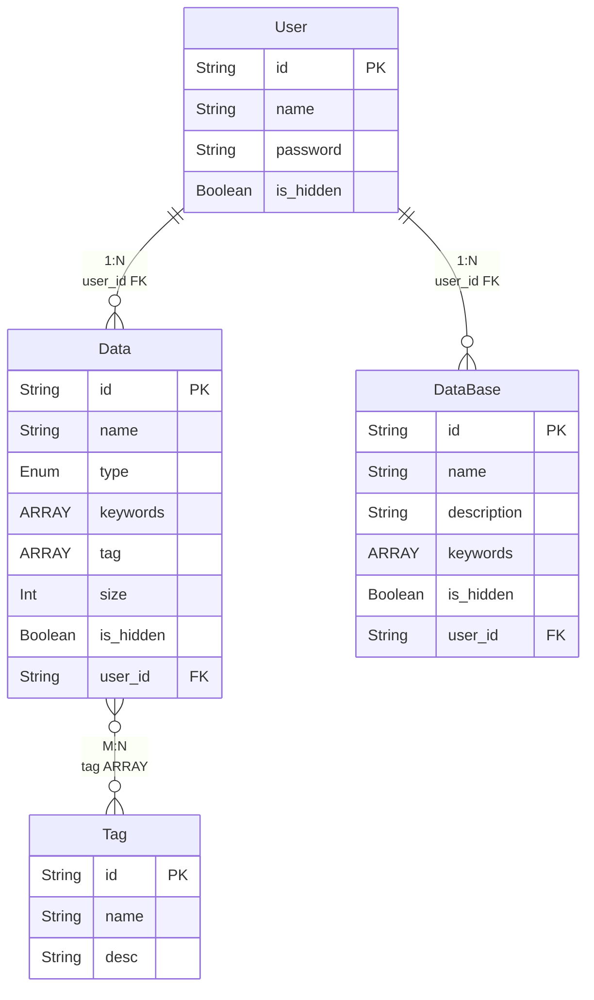
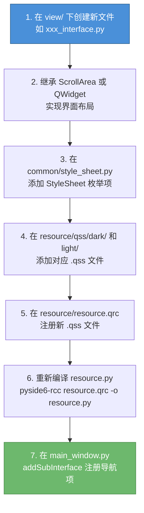

# D-MyDataManager 架构文档

## 1. 架构总览

本项目采用分层架构设计，自上而下分为六层，各层之间通过明确的接口进行通信，上层依赖下层，下层不依赖上层。



| 层级 | 目录 | 职责 |
|------|------|------|
| 入口层 | `src/demo.py` | 应用启动入口，负责 QApplication 创建、配置加载、翻译安装、主窗口创建 |
| 视图层 | `src/app/view/` | 界面展示与用户交互，包含主窗口和各功能页面 |
| 组件层 | `src/app/components/` | 可复用 UI 组件，供视图层组合使用 |
| 公共层 | `src/app/common/` | 配置管理、信号总线、样式、图标、翻译、数据库工具等基础设施 |
| 数据层 | `src/app/model/` + `src/app/common/init/` | ORM 模型定义、数据库引擎初始化、日志初始化 |
| 资源层 | `src/app/resource/` | 图片、样式表、国际化文件等静态资源 |

---

## 2. 目录结构说明

```
src/
├── demo.py                              # 应用入口
├── app/
│   ├── __init__.py                      # 包初始化（空文件）
│   ├── common/                          # 公共模块
│   │   ├── __init__.py                  # 包初始化（空文件）
│   │   ├── config.py                    # 配置管理（Config 类、配置项定义、加载逻辑）
│   │   ├── signal_bus.py                # 信号总线（跨组件通信）
│   │   ├── icon.py                      # 图标枚举管理
│   │   ├── style_sheet.py               # 样式表枚举管理
│   │   ├── translator.py                # 翻译文本管理
│   │   ├── db.py                        # 数据库会话工具
│   │   ├── init/                        # 初始化模块
│   │   │   ├── __init__.py              # 导出 init_log / engine / DBSession
│   │   │   ├── init_db.py               # 数据库引擎与会话工厂初始化
│   │   │   └── init_log.py              # loguru 日志系统初始化
│   │   └── util/                        # 工具模块
│   │       ├── __init__.py              # 导出 is_win11
│   │       └── util_win.py              # Windows 平台工具函数
│   ├── components/                      # 组件模块
│   │   ├── __init__.py                  # 导出 LinkCardView / SampleCardView / TimePickerDialog
│   │   ├── link_card.py                 # 链接卡片组件
│   │   ├── sample_card.py               # 示例卡片组件
│   │   └── time_picker_dialog.py        # 时间选择器对话框
│   ├── config/
│   │   └── config.json                  # 运行时配置文件
│   ├── model/                           # 数据模型
│   │   ├── Base.py                      # SQLAlchemy ORM 基类
│   │   ├── Data.py                      # 数据条目模型
│   │   ├── DataBase.py                  # 数据库条目模型
│   │   ├── Tag.py                       # 标签模型
│   │   └── User.py                      # 用户模型
│   ├── resource/                        # 资源模块
│   │   ├── resource.py                  # PyQt 资源编译输出
│   │   ├── resource.qrc                 # 资源配置文件
│   │   ├── i18n/                        # 国际化翻译文件
│   │   │   ├── app.zh_CN.ts             # 中文翻译源文件
│   │   │   └── app.zh_CN.qm             # 中文翻译编译文件
│   │   ├── images/                      # 图片资源
│   │   │   ├── controls/                # 控件示例图标
│   │   │   ├── icons/                   # 应用图标（SVG，区分明暗主题）
│   │   │   ├── header1.png              # 首页 Banner 图
│   │   │   └── logo.png                 # 应用 Logo
│   │   └── qss/                         # 样式表文件
│   │       ├── dark/                    # 暗色主题样式
│   │       └── light/                   # 亮色主题样式
│   └── view/                            # 视图模块
│       ├── main_window.py               # 主窗口
│       ├── home_interface.py            # 首页
│       └── setting_interface.py         # 设置页
```

---

## 3. 模块依赖关系



**依赖关系说明：**

| 源模块 | 目标模块 | 依赖内容 |
|--------|----------|----------|
| `demo.py` | `view/main_window` | 导入 MainWindow |
| `demo.py` | `common/config` | 导入 config 实例，读取 DPI/语言配置 |
| `view/main_window` | `view/home_interface` | 创建 HomeInterface 实例 |
| `view/main_window` | `view/setting_interface` | 创建 SettingInterface 实例 |
| `view/main_window` | `common/config` | 读取 Mica/DPI 等窗口配置 |
| `view/main_window` | `common/signal_bus` | 连接信号到槽函数 |
| `view/main_window` | `common/icon` | 使用自定义图标 |
| `view/main_window` | `common/translator` | 使用翻译文本 |
| `view/home_interface` | `components/link_card` | 使用 LinkCardView |
| `view/home_interface` | `components/sample_card` | 使用 SampleCardView |
| `view/home_interface` | `common/style_sheet` | 应用样式表 |
| `view/home_interface` | `common/config` | 读取配置 |
| `view/setting_interface` | `components/time_picker_dialog` | 使用 TimePickerDialog |
| `view/setting_interface` | `common/config` | 读写各项配置 |
| `view/setting_interface` | `common/signal_bus` | 发送 micaEnableChanged 信号 |
| `view/setting_interface` | `common/style_sheet` | 应用样式表 |
| `view/setting_interface` | `common/util` | 判断是否 Win11 |
| `components/link_card` | `common/style_sheet` | 应用样式表 |
| `components/sample_card` | `common/signal_bus` | 发送 switchToSampleCard 信号 |
| `components/sample_card` | `common/style_sheet` | 应用样式表 |
| `components/time_picker_dialog` | `common/style_sheet` | 应用样式表 |
| `common/init/init_db` | `common/config` | 读取数据库连接配置 |
| `common/init/init_log` | `common/config` | 读取日志配置 |
| `common/db` | `common/init` | 使用 DBSession 创建会话 |

---

## 4. 各文件功能说明

### 入口文件

| 文件 | 职责 | 关键类/函数 | 对外接口 |
|------|------|-------------|----------|
| `demo.py` | 应用启动入口 | `app` (QApplication), `w` (MainWindow) | 无，直接执行 |

### 视图层文件

| 文件 | 职责 | 关键类/函数 | 对外接口 |
|------|------|-------------|----------|
| `main_window.py` | 主窗口，管理导航栏与子页面 | `MainWindow(FluentWindow)` | 构造函数创建完整主窗口 |
| `home_interface.py` | 首页，展示 Banner 和示例卡片 | `BannerWidget(QWidget)`, `HomeInterface(ScrollArea)` | 构造函数创建首页视图 |
| `setting_interface.py` | 设置页，提供个性化/日志/数据库等配置 | `SettingInterface(ScrollArea)` | 构造函数创建设置页视图 |

### 组件层文件

| 文件 | 职责 | 关键类/函数 | 对外接口 |
|------|------|-------------|----------|
| `link_card.py` | 可点击的链接卡片 | `LinkCard(QFrame)`, `LinkCardView(SingleDirectionScrollArea)` | `LinkCardView.addCard(icon, title, content, url)` |
| `sample_card.py` | 示例展示卡片 | `SampleCard(CardWidget)`, `SampleCardView(QWidget)` | `SampleCardView.addSampleCard(icon, title, content, routeKey, index)` |
| `time_picker_dialog.py` | 时间选择对话框 | `TimePickerDialog(QDialog)` | `timeSelected` 信号, `get_time()`, `get_full_time()`, `set_title()`, `set_time_format()` |

### 公共层文件

| 文件 | 职责 | 关键类/函数 | 对外接口 |
|------|------|-------------|----------|
| `config.py` | 集中管理所有配置项 | `Config(QConfig)`, `Language(Enum)`, `LanguageSerializer`, `FileTimeSerializer`, `load_config()` | `config` 全局实例 |
| `signal_bus.py` | 跨组件信号通信总线 | `SignalBus(QObject)` | `signalBus` 全局实例，含 `switchToSampleCard`, `micaEnableChanged`, `supportSignal` 信号 |
| `icon.py` | 自定义图标枚举 | `Icon(FluentIconBase, Enum)` | `Icon.GRID`, `Icon.MENU`, `Icon.TEXT`, `Icon.PRICE`, `Icon.EMOJI_TAB_SYMBOLS` |
| `style_sheet.py` | 样式表枚举管理 | `StyleSheet(StyleSheetBase, Enum)` | `StyleSheet.LINK_CARD`, `.SAMPLE_CARD`, `.HOME_INTERFACE`, `.SETTING_INTERFACE`, `.TIME_PICKER_DIALOG` |
| `translator.py` | 翻译文本管理 | `Translator(QObject)` | `Translator` 实例，含各分类翻译文本属性 |
| `db.py` | 数据库会话创建工具 | `create_session()` | `create_session()` → 返回 SQLAlchemy Session 或 None |
| `init/init_db.py` | 数据库引擎与会话工厂初始化 | `_init_engine()`, `_init_dbsession()` | `engine` (SQLAlchemy Engine), `DBSession` (sessionmaker) |
| `init/init_log.py` | loguru 日志系统初始化 | `init_log()`, `_set_logger_config()`, `_get_log_file_path()` | `init_log()` → 配置并启动日志系统 |
| `util/util_win.py` | Windows 平台工具 | `is_win11()` | `is_win11()` → bool |

### 数据层文件

| 文件 | 职责 | 关键类/函数 | 对外接口 |
|------|------|-------------|----------|
| `Base.py` | SQLAlchemy ORM 基类 | `Base = declarative_base()` | `Base` 全局实例 |
| `Data.py` | 数据条目模型 | `DataType(Enum)`, `Data(Base)` | `Data` ORM 模型，表名 `datas` |
| `DataBase.py` | 数据库条目模型 | `DataBase(Base)` | `DataBase` ORM 模型，表名 `databases` |
| `Tag.py` | 标签模型 | `Tag(Base)` | `Tag` ORM 模型，表名 `tags` |
| `User.py` | 用户模型 | `User(Base)` | `User` ORM 模型，表名 `users` |

### 资源层文件

| 文件 | 职责 | 关键类/函数 | 对外接口 |
|------|------|-------------|----------|
| `resource.qrc` | Qt 资源配置文件 | XML 格式定义资源映射 | 由 `pyside6-rcc` 编译为 `resource.py` |
| `resource.py` | 编译后的 Python 资源模块 | 自动生成 | `:/app/` 资源路径前缀 |
| `i18n/app.zh_CN.ts` | 中文翻译源文件 | Qt Linguist 格式 | 翻译条目编辑 |
| `i18n/app.zh_CN.qm` | 中文翻译编译文件 | 二进制格式 | 由 QTranslator 加载 |
| `qss/dark/*.qss` | 暗色主题样式表 | CSS 子集 | 按 `StyleSheet` 枚举加载 |
| `qss/light/*.qss` | 亮色主题样式表 | CSS 子集 | 按 `StyleSheet` 枚举加载 |

---

## 5. 数据流说明

### 5.1 启动流程



### 5.2 配置流



### 5.3 信号流



### 5.4 数据模型关系



**ORM 关系说明：**

- **User → Data**：一对多，一个用户拥有多条数据，通过 `Data.user_id` 外键关联
- **User → DataBase**：一对多，一个用户拥有多个数据库条目，通过 `DataBase.user_id` 外键关联
- **Data ↔ Tag**：多对多，通过 `Data.tag` 数组字段存储标签名称（非外键，松耦合）

---

## 6. 扩展指南

### 6.1 新增视图模块



**具体步骤：**

1. 在 `src/app/view/` 下创建 `xxx_interface.py`，定义继承 `ScrollArea` 的类
2. 在 `__initWidget` 中调用 `StyleSheet.XXX_INTERFACE.apply(self)` 应用样式
3. 在 `common/style_sheet.py` 的 `StyleSheet` 枚举中添加 `XXX_INTERFACE = "xxx_interface"`
4. 在 `resource/qss/dark/` 和 `resource/qss/light/` 下分别创建 `xxx_interface.qss`
5. 在 `resource/resource.qrc` 中添加两个 qss 文件的 `<file>` 条目
6. 运行 `pyside6-rcc resource.qrc -o resource.py` 重新编译资源
7. 在 `main_window.py` 的 `initNavigation` 中调用 `self.addSubInterface` 注册新页面

### 6.2 新增组件

**具体步骤：**

1. 在 `src/app/components/` 下创建 `xxx_component.py`
2. 实现组件类，继承合适的 Qt 基类（如 `QFrame`、`QWidget`、`QDialog`）
3. 如需样式，在 `StyleSheet` 枚举中添加项，并创建对应的 `.qss` 文件
4. 如需跨组件通信，通过 `signalBus` 发送/接收信号
5. 在 `components/__init__.py` 中导出新组件

### 6.3 新增数据模型

**具体步骤：**

1. 在 `src/app/model/` 下创建 `XxxModel.py`
2. 导入 `Base`，定义继承 `Base` 的模型类
3. 设置 `__tablename__`，定义 `Column` 字段
4. 如需外键关系，使用 `ForeignKey` 关联已有模型
5. 在业务代码中通过 `create_session()` 获取会话进行 CRUD 操作

### 6.4 新增配置项

**具体步骤：**

1. 在 `common/config.py` 的 `Config` 类中添加新的 `ConfigItem` / `OptionsConfigItem` / `RangeConfigItem` 等属性
2. 指定分组（Group）、键名（Key）、默认值、验证器
3. 如需修改后重启生效，设置 `restart=True`
4. 如需在设置页展示，在 `setting_interface.py` 中创建对应的 `SettingCard` 并加入布局
5. 配置会自动持久化到 `config.json`

### 6.5 新增国际化语言

**具体步骤：**

1. 在 `common/config.py` 的 `Language` 枚举中添加新语言项（如 `JAPANESE`）
2. 在 `LanguageSerializer` 中确保新语言的序列化/反序列化逻辑正确
3. 在 `resource/i18n/` 下创建对应的 `.ts` 翻译源文件（如 `app.ja_JP.ts`）
4. 使用 Qt Linguist 编辑 `.ts` 文件，填写翻译内容
5. 编译 `.ts` 为 `.qm` 文件：`lrelease app.ja_JP.ts -qm app.ja_JP.qm`
6. 在 `resource/resource.qrc` 中注册新的 `.qm` 文件
7. 重新编译 `resource.py`
8. 在 `setting_interface.py` 的 `languageCard` 的 `texts` 列表中添加新语言选项

---

## 变更记录

| 日期 | 变更内容 | 变更人 |
|------|----------|--------|
| | | |
