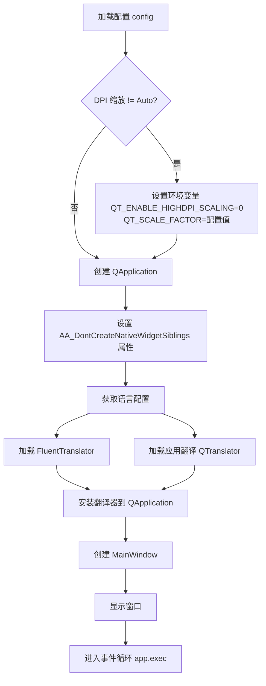
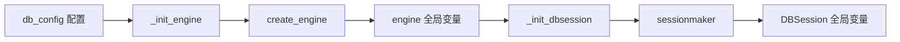
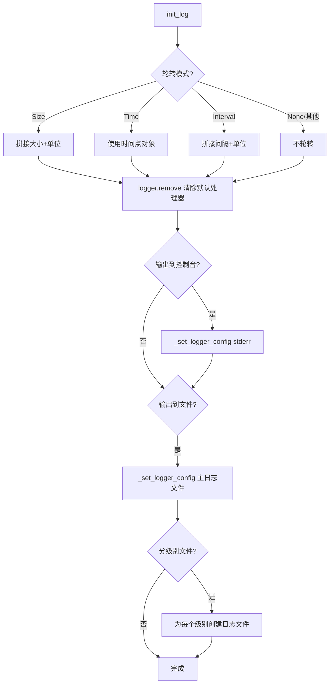
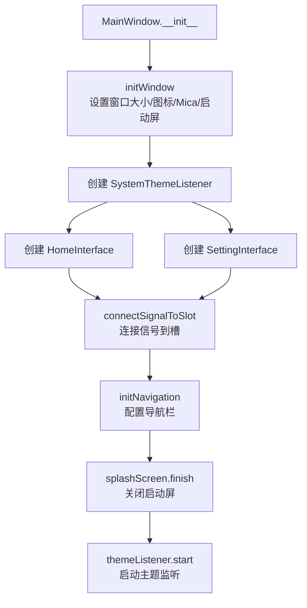
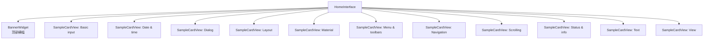

# D-MyDataManager 项目文档

---

## 1. 项目概述

| 项目属性 | 值 |
|---------|---|
| 项目名称 | D-MyDataManager（数据管理器） |
| 版本 | v0.0.0 |
| 作者 | taishoubuzhi |
| 技术栈 | Python + PyQt6 + qfluentwidgets + SQLAlchemy + loguru |

### 项目定位

基于 PyQt6 和 qfluentwidgets 的数据管理桌面应用，采用 Fluent Design 风格，支持 Mica 效果、暗色/亮色主题切换、国际化（中英文），提供可配置的日志系统和数据库连接管理。

### 技术栈说明

| 技术 | 用途 |
|------|------|
| PyQt6 | GUI 框架，提供窗口、控件、事件系统 |
| qfluentwidgets | Fluent Design 风格控件库，提供现代化 UI 组件 |
| SQLAlchemy | ORM 框架，管理数据库模型和会话 |
| loguru | 日志框架，支持多级别、轮转、压缩 |

### 项目目录结构

```
src/
├── demo.py                    # 应用入口
└── app/
    ├── common/                # 公共模块
    │   ├── config.py          # 配置管理
    │   ├── signal_bus.py      # 信号总线
    │   ├── icon.py            # 图标管理
    │   ├── style_sheet.py     # 样式管理
    │   ├── translator.py      # 翻译管理
    │   ├── db.py              # 数据库工具
    │   ├── init/              # 初始化模块
    │   │   ├── init_db.py     # 数据库初始化
    │   │   └── init_log.py    # 日志初始化
    │   └── util/              # 工具模块
    │       └── util_win.py    # Windows 平台工具
    ├── components/            # 组件模块
    │   ├── link_card.py       # 链接卡片
    │   ├── sample_card.py     # 示例卡片
    │   └── time_picker_dialog.py  # 时间选择器对话框
    ├── config/
    │   └── config.json        # 配置文件
    ├── model/                 # 数据模型
    │   ├── Base.py            # 模型基类
    │   ├── Data.py            # 数据模型
    │   ├── DataBase.py        # 数据库模型
    │   ├── Tag.py             # 标签模型
    │   └── User.py            # 用户模型
    ├── resource/              # 资源模块
    │   ├── resource.py        # 编译后的资源文件
    │   ├── resource.qrc       # 资源描述文件
    │   ├── images/            # 图片资源
    │   ├── qss/               # 样式资源
    │   └── i18n/              # 国际化资源
    └── view/                  # 视图模块
        ├── main_window.py     # 主窗口
        ├── home_interface.py  # 首页
        └── setting_interface.py  # 设置页
```

---

## 2. 入口模块

**文件路径**: `src/demo.py`

### 启动流程



### 关键代码逻辑

1. **DPI 缩放**: 在创建 QApplication 之前，根据配置决定是否启用高 DPI 缩放。若配置值非 `Auto`，则禁用自动缩放并手动设置缩放因子。

2. **翻译加载**: 同时加载两个翻译器——`FluentTranslator`（qfluentwidgets 控件库翻译）和 `QTranslator`（应用自定义翻译，从 `:/app/i18n` 资源加载）。

3. **主窗口创建**: 实例化 `MainWindow` 并显示，随后进入 Qt 事件循环。

```python
from app.common.config import config
from app.view.main_window import MainWindow

if config.get(config.dpi_scale) != "Auto":
    os.environ["QT_ENABLE_HIGHDPI_SCALING"] = "0"
    os.environ["QT_SCALE_FACTOR"] = str(config.get(config.dpi_scale))

app = QApplication(sys.argv)
app.setAttribute(Qt.ApplicationAttribute.AA_DontCreateNativeWidgetSiblings)

locale = config.get(config.language).value
translator = FluentTranslator(locale)
appTranslator = QTranslator()
appTranslator.load(locale, "app", ".", ":/app/i18n")

app.installTranslator(translator)
app.installTranslator(appTranslator)

w = MainWindow()
w.show()
app.exec()
```

---

## 3. 公共模块 (common)

### 3.1 配置管理 (config.py)

**文件路径**: `src/app/common/config.py`

使用 qfluentwidgets 的 `QConfig` 体系管理应用配置，支持配置分组、类型校验、序列化和持久化。

#### 常量定义

| 常量 | 值 | 说明 |
|------|---|------|
| YEAR | 2026 | 项目年份 |
| AUTHOR | "taishoubuzhi" | 作者 |
| VERSION | "v0.0.0" | 版本号 |
| LOG_LEVELS | ["Trace", "Debug", "Info", "Success", "Warn", "Error", "Critical"] | 日志级别列表 |
| ENCODINGS | ["utf-8"] | 编码选项 |
| ROTATE_MODES | ["None", "Size", "Time", "Interval"] | 日志轮转模式 |
| ROTATE_SIZE_UNITS | ["B", "KB", "MB", "GB"] | 轮转大小单位 |
| ROTATE_INTERVAL_UNITS | ["second", "minute", "hour", "day"] | 轮转间隔单位 |
| RETENTION_UNITS | ["seconds", "minutes", "hours", "days"] | 保留时长单位 |
| COMPRESS_MODES | ["None", "zip"] | 压缩模式 |

#### 自定义序列化器

**LanguageSerializer**: 将 `Language` 枚举序列化为语言名称字符串，反序列化时还原为 `QLocale` 对象。

**FileTimeSerializer**: 将 `datetime.time` 序列化为 `HH:MM` 格式字符串，反序列化时支持 `HH:MM` 和 `HHH:MMM` 两种格式，解析失败时返回 `00:00:00`。

#### 配置分组

**Material 分组**

| 配置项 | 键名 | 类型 | 默认值 | 说明 |
|--------|------|------|--------|------|
| blurRadius | AcrylicBlurRadius | RangeConfigItem | 15 | 亚克力模糊半径，范围 0-40 |

**MainWindow 分组**

| 配置项 | 键名 | 类型 | 默认值 | 说明 |
|--------|------|------|--------|------|
| micaEnabled | MicaEnabled | ConfigItem(BoolValidator) | is_win11() | Mica 效果开关 |
| dpi_scale | DpiScale | OptionsConfigItem | "Auto" | DPI 缩放，选项: 1, 1.25, 1.5, 1.75, 2, Auto |
| language | Language | OptionsConfigItem | Language.AUTO | 界面语言 |
| dynamic_config_display | DynamicConfigDisplay | ConfigItem(BoolValidator) | False | 动态配置显示开关 |

**Update 分组**

| 配置项 | 键名 | 类型 | 默认值 | 说明 |
|--------|------|------|--------|------|
| check_update_at_start_up | CheckUpdateAtStartUp | ConfigItem(BoolValidator) | True | 启动时检查更新 |

**Log 分组**

| 配置项 | 键名 | 类型 | 默认值 | 说明 |
|--------|------|------|--------|------|
| log_level | Log-Level | OptionsConfigItem | "Debug" | 日志级别 |
| log_format | Log-Format | ConfigItem | "{time} \| {level} \| {message}" | 日志格式 |
| format_to_json | Format-To-JSON | ConfigItem(BoolValidator) | False | JSON 格式开关 |
| json_format | JSON-Format | ConfigItem | "{time} \| {level} \| {message}" | JSON 日志格式 |
| catch | Catch | ConfigItem(BoolValidator) | True | 捕获异常 |
| output_console | Output-Console | ConfigItem(BoolValidator) | True | 控制台输出 |
| enqueue | Enqueue | ConfigItem(BoolValidator) | True | 异步队列 |
| encoding | Encoding | OptionsConfigItem | "utf-8" | 编码 |
| backtrace | Backtrace | ConfigItem(BoolValidator) | True | 异常回溯 |
| diagnose | Diagnose | ConfigItem(BoolValidator) | True | 诊断模式 |

**File 分组**

| 配置项 | 键名 | 类型 | 默认值 | 说明 |
|--------|------|------|--------|------|
| output_file | Output-File | ConfigItem(BoolValidator) | True | 文件输出开关 |
| different_level_file | Different-Level-Files | ConfigItem(BoolValidator) | True | 分级别文件开关 |

**Log-File 分组**

| 配置项 | 键名 | 类型 | 默认值 | 说明 |
|--------|------|------|--------|------|
| file_path | Log-Path | ConfigItem(FolderValidator) | "logs" | 日志目录 |
| trace_level_file | File-Trace | ConfigItem | "trace.log" | Trace 级别文件名 |
| debug_level_file | File-Debug | ConfigItem | "debug.log" | Debug 级别文件名 |
| info_level_file | File-Info | ConfigItem | "info.log" | Info 级别文件名 |
| success_level_file | File-Success | ConfigItem | "success.log" | Success 级别文件名 |
| warning_level_file | File-Warn | ConfigItem | "warn.log" | Warning 级别文件名 |
| error_level_file | File-Error | ConfigItem | "error.log" | Error 级别文件名 |
| critical_level_file | File-Critical | ConfigItem | "critical.log" | Critical 级别文件名 |
| log_file | File-Log | ConfigItem | "log.log" | 综合日志文件名 |
| file_override | File-Overwrite | ConfigItem(BoolValidator) | True | 文件覆盖开关 |
| rotate_mode | Rotate-Mode | OptionsConfigItem | "None" | 轮转模式 |
| rotate_size | Rotate-Size | RangeConfigItem | 1 | 轮转大小，范围 1-1024 |
| rotate_size_unit | Rotate-Size-Unit | OptionsConfigItem | "MB" | 轮转大小单位 |
| rotate_time | Rotate-Time | ConfigItem(FileTimeSerializer) | 00:00 | 轮转时间点 |
| rotate_interval | Rotate-Interval | RangeConfigItem | 1 | 轮转间隔，范围 1-24 |
| rotate_interval_unit | Rotate-Interval-Unit | OptionsConfigItem | "hour" | 轮转间隔单位 |
| retention | Retention | RangeConfigItem | 7 | 保留时长，范围 1-365 |
| retention_unit | Retention-Unit | OptionsConfigItem | "days" | 保留时长单位 |
| compress_mode | Compress-Mode | OptionsConfigItem | "None" | 压缩模式 |

**DB 分组**

| 配置项 | 键名 | 类型 | 默认值 | 说明 |
|--------|------|------|--------|------|
| url | URL | ConfigItem | "sqlite:///data.db" | 数据库连接 URL |
| echo | Echo | ConfigItem(BoolValidator) | True | SQL 回显 |
| pool_size | Pool-Size | RangeConfigItem | 10 | 连接池大小，范围 0-20 |
| max_overflow | Max-Overflow | RangeConfigItem | 20 | 最大溢出，范围 0-20 |
| pool_recycle | Pool-Recycle | RangeConfigItem | 3600 | 连接回收时间，范围 0-86400 |
| pool_pre_ping | Pool-Pre-Ping | ConfigItem(BoolValidator) | True | 连接预检测 |
| connect_args | Connect-Args | ConfigItem | {} | 连接参数 |

#### 配置加载

```python
config = Config()
load_config()
```

`load_config()` 调用 `qconfig.load()` 从 `app/config/config.json` 加载配置并应用到 `config` 单例。

---

### 3.2 信号总线 (signal_bus.py)

**文件路径**: `src/app/common/signal_bus.py`

使用 PyQt6 的 `pyqtSignal` 机制实现全局信号总线，用于模块间松耦合通信。

| 信号 | 参数类型 | 说明 |
|------|---------|------|
| switchToSampleCard | str, int | 切换到示例卡片，参数为路由键和索引 |
| micaEnableChanged | bool | Mica 效果启用状态变更 |
| supportSignal | 无 | 支持信号 |

```python
class SignalBus(QObject):
    switchToSampleCard = pyqtSignal(str, int)
    micaEnableChanged = pyqtSignal(bool)
    supportSignal = pyqtSignal()

signalBus = SignalBus()
```

全局单例 `signalBus` 在模块导入时创建，任何模块均可通过 `signalBus` 发送和接收信号。

---

### 3.3 图标管理 (icon.py)

**文件路径**: `src/app/common/icon.py`

继承 `FluentIconBase` 枚举，定义应用自定义图标，根据主题自动切换黑白版本。

| 枚举值 | 资源文件名 | 说明 |
|--------|-----------|------|
| GRID | Grid_black.svg / Grid_white.svg | 网格图标 |
| MENU | Menu_black.svg / Menu_white.svg | 菜单图标 |
| TEXT | Text_black.svg / Text_white.svg | 文本图标 |
| PRICE | Price_black.svg / Price_white.svg | 价格图标 |
| EMOJI_TAB_SYMBOLS | EmojiTabSymbols_black.svg / EmojiTabSymbols_white.svg | 符号图标 |

```python
class Icon(FluentIconBase, Enum):
    GRID = "Grid"
    MENU = "Menu"
    TEXT = "Text"
    PRICE = "Price"
    EMOJI_TAB_SYMBOLS = "EmojiTabSymbols"

    def path(self, theme=Theme.AUTO):
        return f":/app/images/icons/{self.value}_{getIconColor(theme)}.svg"
```

`path()` 方法根据当前主题返回对应颜色的 SVG 路径：暗色主题使用 `_white` 后缀，亮色主题使用 `_black` 后缀。

---

### 3.4 样式管理 (style_sheet.py)

**文件路径**: `src/app/common/style_sheet.py`

继承 `StyleSheetBase` 枚举，定义应用自定义样式表，根据主题自动加载 dark/light 目录下的 qss 文件。

| 枚举值 | QSS 文件 | 说明 |
|--------|---------|------|
| LINK_CARD | link_card.qss | 链接卡片样式 |
| SAMPLE_CARD | sample_card.qss | 示例卡片样式 |
| HOME_INTERFACE | home_interface.qss | 首页样式 |
| SETTING_INTERFACE | setting_interface.qss | 设置页样式 |
| TIME_PICKER_DIALOG | time_picker_dialog.qss | 时间选择器对话框样式 |

```python
class StyleSheet(StyleSheetBase, Enum):
    LINK_CARD = "link_card"
    SAMPLE_CARD = "sample_card"
    HOME_INTERFACE = "home_interface"
    SETTING_INTERFACE = "setting_interface"
    TIME_PICKER_DIALOG = "time_picker_dialog"

    def path(self, theme=Theme.AUTO):
        theme = qconfig.theme if theme == Theme.AUTO else theme
        return f":/app/qss/{theme.value.lower()}/{self.value}.qss"
```

使用方式：`StyleSheet.LINK_CARD.apply(widget)`，将对应主题的 QSS 样式应用到指定控件。

---

### 3.5 翻译管理 (translator.py)

**文件路径**: `src/app/common/translator.py`

继承 `QObject`，利用 Qt 的翻译机制管理界面文本。所有文本通过 `self.tr()` 标记为可翻译文本，配合 `.ts` 翻译源文件实现国际化。

| 属性 | 默认文本（英文） | 说明 |
|------|----------------|------|
| text | "Text" | 文本 |
| view | "View" | 视图 |
| menus | "Menus & toolbars" | 菜单和工具栏 |
| icons | "Icons" | 图标 |
| layout | "Layout" | 布局 |
| dialogs | "Dialogs & flyouts" | 对话框和弹出框 |
| scroll | "Scrolling" | 滚动 |
| material | "Material" | 材质 |
| dateTime | "Date & time" | 日期和时间 |
| navigation | "Navigation" | 导航 |
| basicInput | "Basic input" | 基本输入 |
| statusInfo | "Status & info" | 状态和信息 |
| price | "Price" | 价格 |

```python
class Translator(QObject):
    def __init__(self, parent=None):
        super().__init__(parent=parent)
        self.text = self.tr('Text')
        self.view = self.tr('View')
        self.menus = self.tr('Menus & toolbars')
        self.icons = self.tr('Icons')
        self.layout = self.tr('Layout')
        self.dialogs = self.tr('Dialogs & flyouts')
        self.scroll = self.tr('Scrolling')
        self.material = self.tr('Material')
        self.dateTime = self.tr('Date & time')
        self.navigation = self.tr('Navigation')
        self.basicInput = self.tr('Basic input')
        self.statusInfo = self.tr('Status & info')
        self.price = self.tr("Price")
```

---

### 3.6 数据库工具 (db.py)

**文件路径**: `src/app/common/db.py`

提供数据库会话创建的便捷函数。

```python
def create_session():
    session = DBSession()
    if session is None:
        logger.error("session create fail")
        return None
    logger.success("session create success")
    return session
```

`create_session()` 从 `init_db` 模块获取 `DBSession` 工厂，创建新的数据库会话，并通过 loguru 记录创建结果。

---

### 3.7 初始化模块 (init/)

#### 3.7.1 数据库初始化 (init_db.py)

**文件路径**: `src/app/common/init/init_db.py`

使用 SQLAlchemy 创建数据库引擎和会话工厂。



`_init_engine()` 根据 DB 分组配置创建 SQLAlchemy 引擎，参数包括 URL、回显、连接池大小、溢出、回收时间、预检测和连接参数。

`_init_dbsession()` 使用引擎绑定创建 `sessionmaker` 工厂，全局单例 `DBSession` 用于后续创建数据库会话。

#### 3.7.2 日志初始化 (init_log.py)

**文件路径**: `src/app/common/init/init_log.py`

使用 loguru 初始化日志系统，支持多级别输出、文件轮转和压缩。



`_set_logger_config()` 配置 loguru 的 `logger.add()` 参数，包括日志级别、异步队列、编码、回溯、诊断、格式、轮转策略、保留时长和异常捕获。

`_get_log_file_path()` 根据是否覆盖文件决定文件名：若不覆盖，则在文件名中插入时间戳（格式 `YYYY-MM-DD_HH-MM-SS`），避免日志文件被覆盖。

---

### 3.8 工具模块 (util/)

#### 3.8.1 Windows 平台检测 (util_win.py)

**文件路径**: `src/app/common/util/util_win.py`

```python
def is_win11():
    return sys.platform == 'win32' and sys.getwindowsversion().build >= 22000
```

检测当前系统是否为 Windows 11（构建号 >= 22000），用于决定是否启用 Mica 效果等 Win11 专属特性。

---

## 4. 组件模块 (components)

### 4.1 链接卡片 (link_card.py)

**文件路径**: `src/app/components/link_card.py`

#### LinkCard

可点击的链接卡片，点击后通过系统默认浏览器打开 URL。

| 属性 | 类型 | 说明 |
|------|------|------|
| url | QUrl | 点击后打开的链接 |
| iconWidget | IconWidget | 图标控件 |
| titleLabel | QLabel | 标题标签 |
| contentLabel | QLabel | 内容标签（自动换行，最多28字符） |
| urlWidget | IconWidget | 链接图标 |

- 固定尺寸：198 × 220
- 鼠标样式：手型指针
- 点击事件：调用 `QDesktopServices.openUrl()` 打开链接

#### LinkCardView

水平滚动的链接卡片容器，继承 `SingleDirectionScrollArea`。

- 水平布局，左对齐
- 隐藏水平和垂直滚动条
- 通过 `addCard(icon, title, content, url)` 添加卡片
- 自动应用 `StyleSheet.LINK_CARD` 样式

---

### 4.2 示例卡片 (sample_card.py)

**文件路径**: `src/app/components/sample_card.py`

#### SampleCard

展示控件示例的卡片，点击后发送 `switchToSampleCard` 信号。

| 属性 | 类型 | 说明 |
|------|------|------|
| index | int | 卡片索引 |
| routekey | str | 路由键 |
| iconWidget | IconWidget | 图标控件 |
| titleLabel | QLabel | 标题标签 |
| contentLabel | QLabel | 内容标签（自动换行，最多45字符） |

- 固定尺寸：360 × 90
- 继承 `CardWidget`，自带悬停效果
- 点击事件：通过 `signalBus.switchToSampleCard.emit(self.routekey, self.index)` 发送信号

#### SampleCardView

使用 `FlowLayout` 流式布局的示例卡片容器。

| 属性 | 类型 | 说明 |
|------|------|------|
| titleLabel | QLabel | 分类标题 |
| flowLayout | FlowLayout | 流式布局 |

- 通过 `addSampleCard(icon, title, content, routeKey, index)` 添加卡片
- 自动应用 `StyleSheet.SAMPLE_CARD` 样式

---

### 4.3 时间选择器对话框 (time_picker_dialog.py)

**文件路径**: `src/app/components/time_picker_dialog.py`

#### TimePickerDialog

时间选择对话框，支持自定义时间格式。

| 属性 | 类型 | 说明 |
|------|------|------|
| time_edit | QTimeEdit | 时间编辑控件 |
| ok_button | QPushButton | 确认按钮 |
| cancel_button | QPushButton | 取消按钮 |
| _time_format | str | 时间显示格式 |

**构造参数**:

| 参数 | 类型 | 默认值 | 说明 |
|------|------|--------|------|
| current_time | datetime.time | None | 初始时间，默认 00:00:00 |
| title | str | "Select Time" | 对话框标题 |
| time_format | str | "HH:mm:ss" | 时间显示格式 |
| parent | QWidget | None | 父控件 |

**信号**:

| 信号 | 参数类型 | 说明 |
|------|---------|------|
| timeSelected | object | 用户确认选择时间后发出，参数为 `datetime.time` 对象 |

**方法**:

| 方法 | 说明 |
|------|------|
| get_time() | 根据时间格式返回对应的 `datetime.time`，未包含的时分秒部分为 0 |
| get_full_time() | 返回完整的 `datetime.time`（含时分秒） |
| set_title(title) | 设置对话框标题 |
| set_time_format(time_format) | 动态修改时间显示格式 |

自动应用 `StyleSheet.TIME_PICKER_DIALOG` 样式。

---

## 5. 数据模型 (model)

### 5.1 基类 (Base.py)

**文件路径**: `src/app/model/Base.py`

```python
from sqlalchemy.orm import declarative_base
Base = declarative_base()
```

所有数据模型的声明基类，使用 SQLAlchemy 的 `declarative_base()` 创建。

---

### 5.2 数据模型 (Data.py)

**文件路径**: `src/app/model/Data.py`

#### DataType 枚举

| 枚举值 | 值 | 说明 |
|--------|---|------|
| IMAGE | "image" | 图片 |
| VIDEO | "video" | 视频 |
| AUDIO | "audio" | 音频 |
| DOC | "doc" | Word 文档（.doc） |
| DOCX | "docx" | Word 文档（.docx） |
| EXCEL | "excel" | Excel 表格 |
| PPT | "PPT" | PowerPoint 演示文稿 |
| UNKNOWN | "unknown" | 未知类型 |

#### Data 表

表名：`datas`

| 字段 | 类型 | 说明 |
|------|------|------|
| id | String(20), PK | 主键 |
| name | String(20) | 数据名称 |
| type | Enum(DataType) | 数据类型 |
| keywords | ARRAY(String(10)) | 关键词列表 |
| tag | ARRAY(String(20)) | 标签列表 |
| size | Int | 数据大小 |
| is_hidden | Boolean | 是否隐藏 |
| user_id | String(20), FK → users.id | 所属用户 |

---

### 5.3 数据库模型 (DataBase.py)

**文件路径**: `src/app/model/DataBase.py`

表名：`databases`

| 字段 | 类型 | 说明 |
|------|------|------|
| id | String(20), PK | 主键 |
| name | String(20) | 数据库名称 |
| description | String(256) | 数据库描述 |
| keywords | ARRAY(String(10)) | 关键词列表 |
| is_hidden | Boolean | 是否隐藏 |
| user_id | String(20), FK → users.id | 所属用户 |

---

### 5.4 标签模型 (Tag.py)

**文件路径**: `src/app/model/Tag.py`

表名：`tags`

| 字段 | 类型 | 说明 |
|------|------|------|
| id | String(20), PK | 主键 |
| name | String(20) | 标签名称 |
| desc | String(20) | 标签描述 |

---

### 5.5 用户模型 (User.py)

**文件路径**: `src/app/model/User.py`

表名：`users`

| 字段 | 类型 | 说明 |
|------|------|------|
| id | String(20), PK | 主键 |
| name | String(20) | 用户名 |
| password | String(20) | 密码 |
| is_hidden | Boolean | 是否隐藏 |

---

## 6. 视图模块 (view)

### 6.1 主窗口 (main_window.py)

**文件路径**: `src/app/view/main_window.py`

继承 `FluentWindow`，应用的主窗口框架。



#### 窗口配置

| 属性 | 值 |
|------|---|
| 初始大小 | 960 × 780 |
| 最小宽度 | 760 |
| 窗口图标 | :/app/images/logo.png |
| 窗口标题 | "数据管理器" |
| Mica 效果 | 根据 config.micaEnabled 配置 |
| 导航栏亚克力 | 启用 |

#### 导航栏配置

| 页面 | 图标 | 位置 | 标题 |
|------|------|------|------|
| HomeInterface | FIF.HOME | 顶部 | "Home" |
| SettingInterface | FIF.SETTING | 底部 | "Settings" |

#### 信号连接

| 信号 | 槽函数 | 说明 |
|------|--------|------|
| signalBus.micaEnableChanged | setMicaEffectEnabled | Mica 效果开关 |
| signalBus.switchToSampleCard | switchToSample | 切换到示例卡片 |
| signalBus.supportSignal | onSupport | 支持信号 |

#### 生命周期

- `resizeEvent`: 启动屏跟随窗口大小调整
- `closeEvent`: 终止并清理主题监听器
- `_onThemeChangedFinished`: 主题切换后重试 Mica 效果

---

### 6.2 首页 (home_interface.py)

**文件路径**: `src/app/view/home_interface.py`

#### BannerWidget

顶部横幅组件，展示应用标题和链接卡片。

- 固定高度：336
- 包含标题标签 "Fluent d" 和 `LinkCardView`
- 自定义绘制：圆角矩形 + 线性渐变背景 + 横幅图片

#### HomeInterface

继承 `ScrollArea`，展示各分类的控件示例卡片。



**分类详情**:

| 分类 | 包含的示例卡片 |
|------|--------------|
| Basic input | Button, CheckBox, ComboBox, DropDownButton, HyperlinkButton, RadioButton, Slider, SplitButton, SwitchButton, ToggleButton |
| Date & time | CalendarPicker, DatePicker, TimePicker |
| Dialog | Dialog, MessageBox, ColorDialog, Flyout, TeachingTip |
| Layout | FlowLayout |
| Material | AcrylicLabel |
| Menu & toolbars | RoundMenu, CommandBar, CommandBarFlyout |
| Navigation | BreadcrumbBar, Pivot, TabView |
| Scrolling | ScrollArea, PipsPager |
| Status & info | StateToolTip, InfoBadge, InfoBar, ProgressBar, ProgressRing, ToolTip |
| Text | LineEdit, PasswordLineEdit, SpinBox, TextEdit |
| View | ListView, TableView, TreeView, FlipView |

自动应用 `StyleSheet.HOME_INTERFACE` 样式。

---

### 6.3 设置页 (setting_interface.py)

**文件路径**: `src/app/view/setting_interface.py`

继承 `ScrollArea`，应用设置界面。

```mermaid
flowchart TD
    A[SettingInterface] --> B[Personalization 分组]
    A --> C[Material 分组]
    A --> D[Software update 分组]
    A --> E[Log 分组]
    
    B --> B1[Mica effect 开关]
    B --> B2[Application theme 下拉]
    B --> B3[Theme color 颜色选择]
    B --> B4[Dynamic config display 开关]
    B --> B5[Interface zoom 下拉]
    B --> B6[Language 下拉]
    
    C --> C1[Acrylic blur radius 滑块]
    
    D --> D1[Check for updates 开关]
    
    E --> E1[Log level 下拉]
    E --> E2[Format to JSON 开关]
    E --> E3[Catch 开关]
    E --> E4[Output to console 开关]
    E --> E5[Enqueue 开关]
    E --> E6[Encoding 下拉]
    E --> E7[Backtrace 开关]
    E --> E8[Diagnose 开关]
    E --> E9[Output to file 开关]
    E --> E10[Different level files 开关]
    E --> E11[File path 按钮]
    E --> E12[File override 开关]
    E --> E13[Rotate mode 下拉]
    E --> E14[Rotate size 滑块]
    E --> E15[Rotate size unit 下拉]
    E --> E16[Rotate time 按钮]
    E --> E17[Rotate interval 滑块]
    E --> E18[Rotate interval unit 下拉]
    E --> E19[Retention 滑块]
    E --> E20[Retention unit 下拉]
    E --> E21[Compress mode 下拉]
```



#### 动态配置显示

当 `DynamicConfigDisplay` 开关启用时，设置页会根据当前配置动态显示/隐藏相关卡片：

- `output_file` 关闭时，隐藏其下所有文件相关卡片
- `rotate_mode` 为 `Size` 时，显示 Rotate size 和 Rotate size unit
- `rotate_mode` 为 `Time` 时，显示 Rotate time
- `rotate_mode` 为 `Interval` 时，显示 Rotate interval 和 Rotate interval unit
- `rotate_mode` 为 `None` 时，隐藏所有轮转详情卡片

#### 信号连接

| 信号 | 槽函数 | 说明 |
|------|--------|------|
| config.appRestartSig | __showRestartTooltip | 配置变更需重启提示 |
| config.themeChanged | setTheme | 主题切换 |
| themeColorCard.colorChanged | setThemeColor | 主题颜色变更 |
| micaCard.checkedChanged | signalBus.micaEnableChanged | Mica 效果变更 |
| filePathCard.clicked | __onFilePathCardClicked | 选择日志目录 |
| rotateTimeCard.clicked | __onRotateTimeCardClicked | 选择轮转时间 |
| dynamicConfigDisplayCard.checkedChanged | __updateConfigCardVisibility | 动态显示更新 |
| outputFileCard.checkedChanged | __updateConfigCardVisibility | 动态显示更新 |
| rotateModeCard.comboBox.currentIndexChanged | __updateConfigCardVisibility | 动态显示更新 |

自动应用 `StyleSheet.SETTING_INTERFACE` 样式。

---

## 7. 资源模块 (resource)

**文件路径**: `src/app/resource/`

### 图片资源

| 目录/文件 | 说明 |
|----------|------|
| images/controls/ | 控件图标，共 93 个 PNG 文件，用于首页示例卡片展示 |
| images/icons/ | 导航图标，5 组 SVG 文件（每组含 black/white 两个版本） |
| images/logo.png | 应用图标 |
| images/header1.png | 首页横幅背景图 |

### 样式资源

| 目录 | 文件 | 说明 |
|------|------|------|
| qss/dark/ | home_interface.qss, link_card.qss, sample_card.qss, setting_interface.qss, time_picker_dialog.qss | 暗色主题样式 |
| qss/light/ | home_interface.qss, link_card.qss, sample_card.qss, setting_interface.qss, time_picker_dialog.qss | 亮色主题样式 |

### 国际化资源

| 文件 | 说明 |
|------|------|
| i18n/app.zh_CN.ts | 简体中文翻译源文件（XML 格式，可编辑） |
| i18n/app.zh_CN.qm | 简体中文编译后翻译文件（二进制格式，运行时加载） |

### 编译方式

| 操作 | 命令 |
|------|------|
| 编译资源文件 | `pyside6-rcc resource.qrc -o resource.py` |
| 编译翻译文件 | `pyside6-lrelease app.zh_CN.ts -qm app.zh_CN.qm` |

资源文件通过 Qt 资源系统（`:/app/` 前缀）访问，编译后生成 `resource.py`，在主窗口模块中导入。

---

## 8. 配置系统

**配置文件路径**: `src/app/config/config.json`

### 配置文件结构

```json
{
    "Log": { ... },
    "Material": { ... },
    "Update": { ... },
    "Log-File": { ... },
    "DB": { ... },
    "File": { ... },
    "MainWindow": { ... },
    "QFluentWidgets": { ... }
}
```

### 各分组配置项

**Log 分组**

| 键名 | 类型 | 默认值 | 说明 |
|------|------|--------|------|
| Backtrace | bool | true | 异常回溯 |
| Catch | bool | true | 捕获异常 |
| Diagnose | bool | true | 诊断模式 |
| Encoding | string | "utf-8" | 编码 |
| Enqueue | bool | true | 异步队列 |
| Format-To-JSON | bool | false | JSON 格式 |
| JSON-Format | string | "{time:MMMM D, YYYY > HH:mm:ss!UTC} \| {level} \| {message}" | JSON 日志格式 |
| Log-Format | string | "{time} \| {level} \| {message}" | 日志格式 |
| Log-Level | string | "Debug" | 日志级别 |
| Output-Console | bool | true | 控制台输出 |

**Material 分组**

| 键名 | 类型 | 默认值 | 说明 |
|------|------|--------|------|
| AcrylicBlurRadius | int | 15 | 亚克力模糊半径 |

**Update 分组**

| 键名 | 类型 | 默认值 | 说明 |
|------|------|--------|------|
| CheckUpdateAtStartUp | bool | true | 启动时检查更新 |

**Log-File 分组**

| 键名 | 类型 | 默认值 | 说明 |
|------|------|--------|------|
| Compress-Mode | string | "zip" | 压缩模式 |
| File-Critical | string | "critical.log" | Critical 级别文件 |
| File-Debug | string | "debug.log" | Debug 级别文件 |
| File-Error | string | "error.log" | Error 级别文件 |
| File-Info | string | "info.log" | Info 级别文件 |
| File-Log | string | "log.log" | 综合日志文件 |
| File-Overwrite | bool | true | 覆盖文件 |
| File-Success | string | "success.log" | Success 级别文件 |
| File-Trace | string | "trace.log" | Trace 级别文件 |
| File-Warn | string | "warn.log" | Warning 级别文件 |
| Log-Path | string | "logs" | 日志目录 |
| Retention | int | 7 | 保留时长 |
| Retention-Unit | string | "days" | 保留时长单位 |
| Rotate-Interval | int | 1 | 轮转间隔 |
| Rotate-Interval-Unit | string | "hour" | 轮转间隔单位 |
| Rotate-Mode | string | "None" | 轮转模式 |
| Rotate-Size | int | 1 | 轮转大小 |
| Rotate-Size-Unit | string | "MB" | 轮转大小单位 |
| Rotate-Time | string | "00:00" | 轮转时间点 |

**DB 分组**

| 键名 | 类型 | 默认值 | 说明 |
|------|------|--------|------|
| Connect-Args | object | {} | 连接参数 |
| Echo | bool | true | SQL 回显 |
| Max-Overflow | int | 20 | 最大溢出 |
| Pool-Pre-Ping | bool | true | 连接预检测 |
| Pool-Recycle | int | 3600 | 连接回收时间 |
| Pool-Size | int | 10 | 连接池大小 |
| URL | string | "sqlite:///data.db" | 数据库 URL |

**File 分组**

| 键名 | 类型 | 默认值 | 说明 |
|------|------|--------|------|
| Different-Level-Files | bool | true | 分级别文件 |
| Output-File | bool | true | 文件输出 |

**MainWindow 分组**

| 键名 | 类型 | 默认值 | 说明 |
|------|------|--------|------|
| DpiScale | string | "Auto" | DPI 缩放 |
| DynamicConfigDisplay | bool | true | 动态配置显示 |
| Language | string | "zh_CN" | 界面语言 |
| MicaEnabled | bool | false | Mica 效果 |

**QFluentWidgets 分组**（由 qfluentwidgets 库自动管理）

| 键名 | 类型 | 默认值 | 说明 |
|------|------|--------|------|
| FontFamilies | array | ["Segoe UI", "Microsoft YaHei", "PingFang SC"] | 字体族 |
| ThemeColor | string | "#ff009faa" | 主题颜色 |
| ThemeMode | string | "Dark" | 主题模式 |

---

## 变更记录

| 日期 | 变更内容 | 变更人 |
|------|---------|--------|
| | | |
